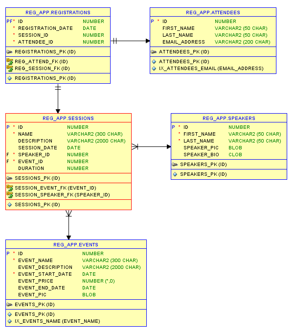
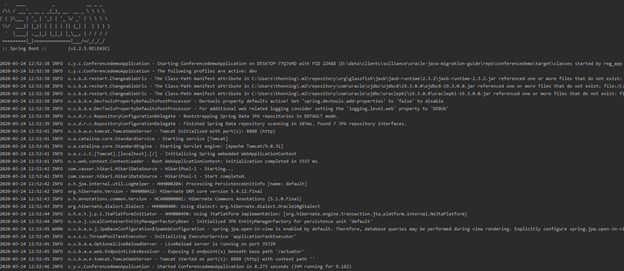

# Setting up the Oracle to PostgreSQL Migration Guide Sample Application
- [Setting up the Oracle to PostgreSQL Migration Guide Sample Application](#setting-up-the-oracle-to-postgresql-migration-guide-sample-application)
  - [Application Architecture](#application-architecture)
  - [Oracle Database ER Diagram](#oracle-database-er-diagram)
  - [Installing the Oracle database](#installing-the-oracle-database)
  - [Installing the Application](#installing-the-application)
    - [Make sure your local Java and Maven environmental variables are set](#make-sure-your-local-java-and-maven-environmental-variables-are-set)
    - [Set your development application runtime environment variables](#set-your-development-application-runtime-environment-variables)
  - [Installing and running the Angular application](#installing-and-running-the-angular-application)
  - [Create and configure your Azure resources](#create-and-configure-your-azure-resources)
    - [Run the ARM template](#run-the-arm-template)
    - [Capture the PostgreSQL configuration](#capture-the-postgresql-configuration)
    - [Update your secrets in Key Vault](#update-your-secrets-in-key-vault)
    - [Update your web application configuration settings](#update-your-web-application-configuration-settings)


## Application Architecture


This sample application utilizes the following frameworks and components.
1. Angular 9 front end
2. Java SE 11 JDK
3. Maven 3.6.3
4. Sprint Boot 2.2.5 RELEASE
5. Embedded Tomcat
6. Oracle 11g
7. npm 6.4.x
8. NodeJS 10.15.x
9. Angular CLI


## Oracle Database ER Diagram


## Installing the Oracle database

In order to run the sample application, you need to have access to some instance of Oracle.  This application has been tested with 11g. The structure is basic enough to work on most versions.  To create your own Oracle instance locally, you can download a copy of Oracle Express Edition.  Also, I would recommend installing the SQLDeveloper client tool as well.  You can use any Oracle compatible client tool of choice.  Once you have access to the database instance, follow these steps.

Create the **REG_APP** user.

>Note: If you are utilizing a server other than a local copy, this account will need elevated permissions to this database in order to properly capture schema and data information for PostgreSQL export.  If you are using a local Oracle XE copy, grant all the rights.


While connected to the REG_APP schema, run the **conferencedemo-oracle.sql** script.  This script will create all of the necessary objects and sample data for your application to run.


 
## Installing the Application

### Make sure your local Java and Maven environmental variables are set


### Set your development application runtime environment variables


>Note:  Your configuration values will be different.  The database user name should be the same.  Use strong passwords.

An alternative, would be to update your application.properties file.  Hardcoding the environment secrets is not recommended.  Injecting them at runtime is a more secure method.


Open your command line or terminal.  Run Maven commands.

``` cmd
    mvn clean package
```

Run your Java API application.



You should see an output similar to this output.

## Installing and running the Angular application

This project requires npm and NodeJS to be installed.

Install the Angular project dependencies

``` cmd
    npm install
```

Build and run the application.

``` cmd
    ng serve -o
```

You should see a web page similar to this:


## Create and configure your Azure resources

### Run the ARM template
<TODO: Include instructions for running template>

### Capture the PostgreSQL configuration

Navigate to the **ora2pg-server** PostgreSQL server resource.  Select the **Overview** link.  Capture the database **Server name** and **Admin username** for later use.


Set up your Firewall rules.  If you have a migration server VM that gets shut down at some point, you will have to edit the firewall rules every time you want to connect because you get a new IP address every time you start the VM.  On-premises development environments with test data may be ok with opening the firewall.  It is better to start off as secure as possible.

**DO NOT USE THIS IP ADDRESS SETTING** if you have ***sensitive protected*** data in this database. It does not matter if it is test data.  If all of your connections are Azure resources, then consider ‘Allow access to Azure services’.


### Update your secrets in Key Vault

- Navigate to the Azure Key Vault. 

- Select the Secrets link. 
  
  These secrets will be injected into the Java application upon initialization.  Defaults were created for you.  You should create a ***strong*** password.  Using well known development passwords exposes your environment to brute force attacks and adds attack vectors.

    

- Create a new version of the password secret.  Store this new password securely for later use in other configuration files.
  
    

### Update your web application configuration settings

Now that you have changed the DB_PASSWORD secret, you will need to update the web application setting.  This will allow the Java API application to connect to the PostgreSQL database.

